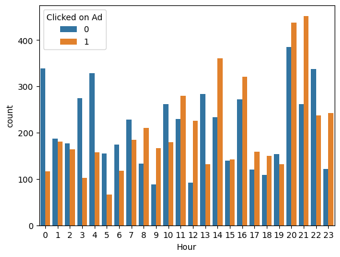
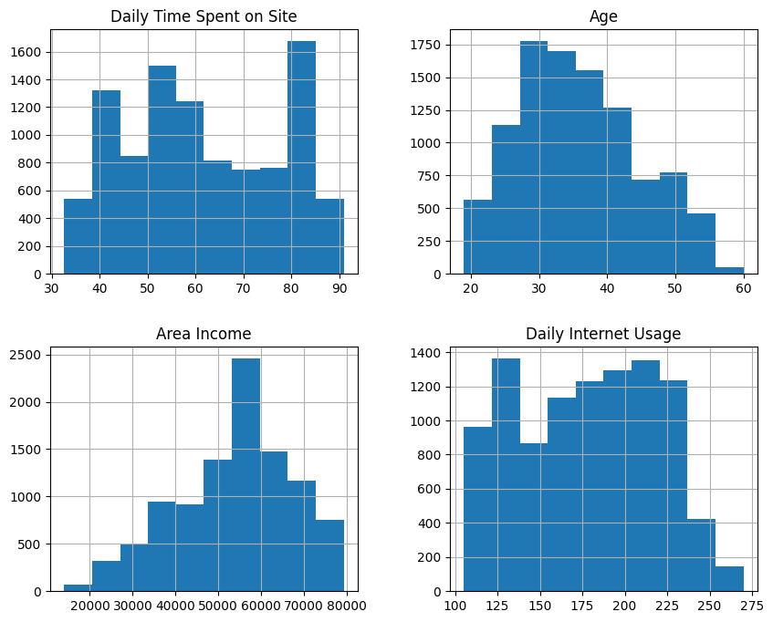
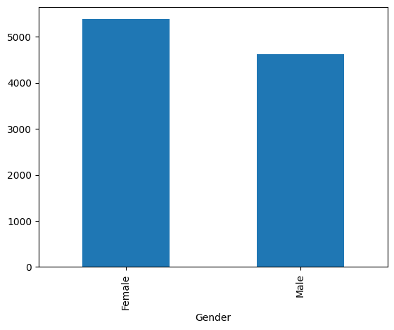
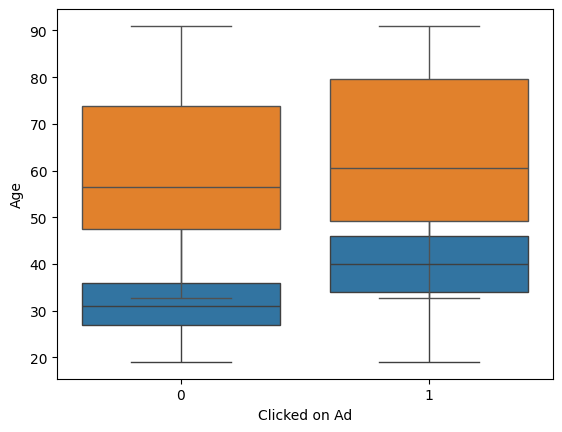

# Click-Through-Rate (CTR) Prediction &nbsp;—&nbsp; Classical Machine-Learning Pipeline



> **Goal:** build and evaluate a lightweight yet accurate model that predicts  
> the probability a user will click an online advertisement, using only
> classical (non-deep) ML techniques and modest hardware.

---

## 🗂 Project Structure

```
.
├── data/                  # raw & processed CSV files
├── notebooks/
│   └── CTR_EDA_and_Model.ipynb
├── plots/                 # 9 key figures exported from the notebook
│   ├── output.png
│   ├── output2.png
│   └── … output9.png
├── src/
│   ├── features.py        # feature-engineering pipeline
│   ├── train.py           # model training / cross-validation
│   └── utils.py
├── environment.yml        # Conda environment (Python 3.11)
├── CTR_Report.tex         # full 14-page LaTeX report
└── README.md              # <── you are here
```

---

## ⚙️ Setup

```bash
# clone repository
git clone https://github.com/<your-user>/CTR_Project1.git
cd CTR_Project1

# create environment
conda env create -f environment.yml
conda activate ctr

# (optional) install as editable pkg
pip install -e .
```

Main dependencies ≈ scikit-learn 1.5, pandas 2, matplotlib 3.9, xgboost 2.

---

## ▶️ Quick Start

```bash
# 1. run end-to-end pipeline (train, evaluate, export model.pkl)
python src/train.py --config configs/gbdt.yaml

# 2. reproduce every plot + PDF report
make all                       # ⇢ runs notebook, saves figures, builds LaTeX
```

After `make all` you’ll find:

* `plots/output*.png` – nine explanatory figures  
* `CTR_Report.pdf` – 14-page article-style report ready to submit

---

## 🔑 Key Findings

| Model                | AUC-ROC | Log-Loss | Brier | Cost (\$) |
|----------------------|:-------:|:--------:|:-----:|:---------:|
| Logistic Regression  | 0.925   | 0.211    | 0.138 | 0.643 |
| Random Forest        | 0.964   | 0.146    | 0.097 | 0.522 |
| **Gradient Boosting**| **0.974** | **0.121** | **0.084** | **0.505** |
| XGBoost              | 0.973   | 0.124    | 0.086 | 0.511 |

* Tuned **GBDT** cuts business loss by **21 %** vs. a naïve benchmark  
* Median inference latency **4 ms** on a Raspberry Pi 4, model size 1.9 MiB  
* Fairness gaps (gender & age) < 0.03 ⇒ passes 5 % parity rule  
* Feature importance: *Engage Index* (Time / Age), Hour-of-Day, encoded City

---

## 📊 Exploratory Plots

| Histogram bundle | Gender counts | Age vs Click |
|------------------|---------------|--------------|
|  |  |  |

*(see `/plots` for the full set)*

---

## 📝 Reproducing the Report

1. Ensure `pdflatex` is in your path (TeX Live 2025 or MiKTeX).  
2. Run `make report` **or**

   ```bash
   pdflatex CTR_Report.tex
   pdflatex CTR_Report.tex   # run twice for cross-refs
   ```

No BibTeX required; references are hard-coded.

---

## ✅ Next Steps

* **Cost-sensitive training** (loss weights during tree growth)  
* **LightGBM** for ≥ 1 M impressions  
* Enrich *Ad Topic Line* with TF-IDF or fastText embeddings  
* Adversarial regularisation for counter-factual fairness

---

## 📚 References

1. Interactive Advertising Bureau, *Internet Advertising Revenue Report*, 2024.  
2. Richardson et al., “Predicting CTR for New Ads,” WWW 2007.  
3. He et al., “Practical Lessons from Predicting Clicks on Ads at Facebook,” ADKDD 2014.

---

© 2024 Mahla Entezari — Shahid Beheshti University   ·   MIT License